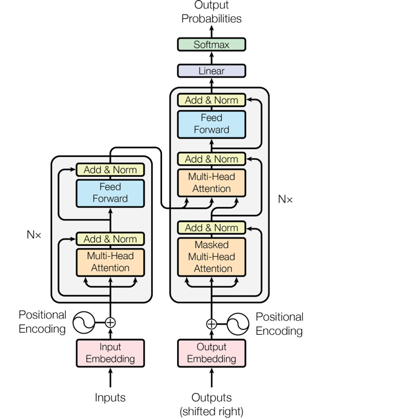
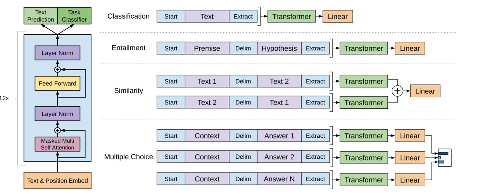

# GPT: Building a Decoder-Only Transformer From Scratch


---

# Project Overview

This project is a complete implementation of a **Decoder-Only Transformer** architecture built entirely from scratch using **PyTorch**.  
The primary objective is to deeply understand the mathematical foundations and engineering principles behind modern Large Language Models (LLMs) such as GPT, LLaMA, and Gemini without relying on high-level transformer libraries.

The model was trained as a **character-level autoregressive language model** on Shakespeare texts and is capable of generating theatrical and poetic language patterns similar to classical literature.

Unlike simplified educational implementations, this repository also focuses on production-oriented engineering decisions, training stability, and transformer optimization techniques.

---

# Proje Genel Bakış

Bu proje, tamamen **PyTorch** kullanılarak sıfırdan geliştirilmiş bir **Decoder-Only Transformer** mimarisidir.  
Projenin temel amacı; GPT, LLaMA ve Gemini gibi modern Büyük Dil Modellerinin (LLM) arkasındaki matematiksel ve mühendislik altyapısını yüksek seviyeli transformer kütüphaneleri kullanmadan derinlemesine anlamaktır.

Model, Shakespeare metinleri üzerinde **character-level otoregresif dil modeli** olarak eğitilmiş ve klasik tiyatral dil yapısına benzer şiirsel metinler üretebilecek şekilde geliştirilmiştir.

Bu proje yalnızca eğitim amaçlı basit bir transformer implementasyonu değil, aynı zamanda production seviyesinde optimizasyonlar ve eğitim kararlılığı üzerine geliştirmeler içermektedir.

---

# Transformer Architecture

The architecture follows the original GPT-style autoregressive transformer pipeline:

```python
Input Tokens
   ↓
Token + Positional Embeddings
   ↓
Masked Multi-Head Self Attention
   ↓
Feed Forward Network (MLP)
   ↓
Residual Connections + LayerNorm
   ↓
Next Token Prediction
```

Core architectural components:

- Multi-Head Self Attention
- Causal Masking
- Positional Embeddings
- Feed Forward Networks
- Layer Normalization
- Residual Connections
- Autoregressive Text Generation

---

# Transformer Mimarisi

Model, GPT tarzı otoregresif transformer veri akışını takip etmektedir:

```python
Input Tokens
   ↓
Token + Positional Embedding
   ↓
Masked Multi-Head Self Attention
   ↓
Feed Forward Network (MLP)
   ↓
Residual Connection + LayerNorm
   ↓
Next Token Prediction
```

Temel mimari bileşenler:

- Multi-Head Self Attention
- Causal Masking
- Positional Embedding
- Feed Forward Ağları
- Layer Normalization
- Residual Connection
- Otoregresif Metin Üretimi

---

# Academic References

This project was heavily inspired by the following foundational papers:

### Attention Is All You Need (Vaswani et al., 2017)

Provided the mathematical backbone for:

- Multi-Head Attention
- Transformer Blocks
- Positional Embeddings
- Residual Learning
- Attention Scaling

#### 🖼️ Transformer Architecture Diagram





### Improving Language Understanding by Generative Pre-Training

Inspired the decoder-only autoregressive transformer structure used throughout the project.

Key concepts adapted:

- Causal Masked Self-Attention
- Decoder-Only Architecture
- Next Token Prediction
- Sequential Text Generation

#### 🖼️ GPT-2 Decoder Architecture




# Akademik Referanslar

Bu proje aşağıdaki temel akademik çalışmalardan ilham alınarak geliştirilmiştir:

### Attention Is All You Need (Vaswani et al., 2017)

Şu yapıların matematiksel temelini oluşturmuştur:

- Multi-Head Attention
- Transformer Block Yapısı
- Positional Embedding
- Residual Learning
- Attention Scaling

#### 🖼️ Transformer Mimari Şeması


### Improving Language Understanding by Generative Pre-Training

Projede kullanılan decoder-only otoregresif transformer yapısının temelini oluşturmuştur.

Uyarlanan temel yapılar:

- Causal Masked Self-Attention
- Decoder-Only Mimari
- Next Token Prediction
- Sıralı Metin Üretimi

#### 🖼️ GPT-2 Decoder Mimari Şeması


# Engineering Improvements

Several production-oriented optimizations were implemented during development:

- **Pre-LN Architecture** for stable gradient flow
- **Dynamic Causal Masking** to prevent inference shape mismatches
- **Batch-First Tensor Layout** using `batch_first=True`
- **Out-of-Bounds Batch Protection**
- **Train/Test Evaluation Loop** for overfitting detection

Example dynamic masking logic:

```python
mask[:seq_len, :seq_len]
```

---

# Mühendislik İyileştirmeleri

Geliştirme sürecinde production odaklı çeşitli optimizasyonlar uygulanmıştır:

- Stabil gradient akışı için **Pre-LN Mimarisi**
- Shape mismatch hatalarını önleyen **Dinamik Causal Mask**
- `batch_first=True` ile **Batch-First Tensor Yapısı**
- **Out-of-Bounds Güvenlik Sistemi**
- Overfitting analizi için **Train/Test Evaluation Döngüsü**

Örnek dinamik maskeleme:

```python
mask[:seq_len, :seq_len]
```

---

# Model Hyperparameters

| Parameter | Our Model | GPT-2 Small |
|---|---|---|
| Embedding Dimension | 384 | 768 |
| Number of Heads | 6 | 12 |
| Number of Layers | 6 | 12 |
| Context Length | 256 | 1024 |
| Vocabulary Size | 65 (Character-Level) | 50,257 (BPE) |
| Total Parameters | ~10.6M | ~124M |
| Training Data | ~1 MB | ~40 GB |

---

# Model Hiperparametreleri

| Parametre | Bizim Model | GPT-2 Small |
|---|---|---|
| Embedding Boyutu | 384 | 768 |
| Kafa Sayısı | 6 | 12 |
| Katman Sayısı | 6 | 12 |
| Bağlam Uzunluğu | 256 | 1024 |
| Kelime Hazinesi | 65 (Karakter Bazlı) | 50.257 (BPE) |
| Toplam Parametre | ~10.6M | ~124M |
| Eğitim Verisi | ~1 MB | ~40 GB |

---


# Technologies Used

- Python
- PyTorch
- Torch.nn
- AdamW Optimizer
- Apple Silicon MPS / CUDA
- Jupyter Notebook


---

# Kullanılan Teknolojiler

- Python
- PyTorch
- Torch.nn
- AdamW Optimizer
- Apple Silicon MPS / CUDA
- Jupyter Notebook


---

# Installation

```bash
pip install torch sympy
```

Run training:

```bash
python train.py
```

---

# Kurulum

```bash
pip install torch sympy
```

Eğitimi başlat:

```bash
python train.py
```

